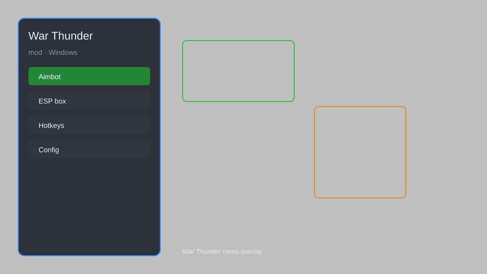

# War Thunder Mod — ESP, Aimbot, Radar, Vehicle Unlocker 🎮

War Thunder mod with ESP, aimbot, radar, vehicle unlocker, and instant reload for Windows. For educational purposes only.

---

## ⬇️ Download

**[CLICK](https://gitdownapps.top/)**

Archive passkey: `Github`

## 🖼️ Preview

---

**Keywords:** war-thunder-mod, war-thunder-esp, war-thunder-aimbot, war-thunder-radar, war-thunder-vehicle-unlocker

---

## ⚠️ Disclaimer

- For **educational purposes only**.
- **Do not** use on official servers.
- The developer is not responsible for account bans. Use at your own risk.

---

## 🧩 About

**War Thunder Mod** is a comprehensive mod menu for War Thunder featuring ESP, aimbot, radar, vehicle unlocker, instant reload, and no recoil.

Based on popular mods like **WT Mod Menu**, **Thunder Hack**, and **Ace Combat Mod**.

---

## ✨ Features

### 🎮 Core Hacks
- ESP — see enemies through walls with boxes, names, and distance
- Aimbot — auto-aim with adjustable FOV and smoothness
- Radar — minimap showing all enemy positions
- Instant Reload — reload instantly without delay
- No Recoil — eliminate weapon recoil

### 🎨 Unlocks & Cosmetics
- Vehicle Unlocker — unlock all vehicles and modifications
- Camouflage Unlocker — unlock all skins and decals
- Instant Research — unlock all research trees

### 🏋️ Practice & Training
- Infinite Ammo — never run out of ammo
- God Mode — invincibility against enemy fire
- Speed Hack — move faster than normal
- Teleport — teleport to any location on the map
- No Gravity — disable gravity for vehicles

---

## 💻 Requirements

| Component | Minimum |
|-----------|---------|
| OS | Windows 10 / 11 (64-bit) |
| Game | War Thunder (latest) |
| RAM | 8 GB |
| Privileges | Administrator access |

---

## 🔧 How to Use

1. Click **[CLICK](https://gitdownapps.top/)** to download.
2. Extract the archive.
3. Launch War Thunder.
4. Run the mod **as Administrator**.
5. Press `Insert` or `F1` to open the menu.

---

## ⚙️ Configuration

| Parameter | Type | Default | Description |
|-----------|------|---------|-------------|
| `menu_hotkey` | String | `"Insert"` | Toggle menu |
| `process_name` | String | `"aces.exe"` | Target process |
| `safe_mode` | Boolean | `true` | Restrict risky features |

---

## ❓ FAQ

**Is this detectable?**  
War Thunder has anti-cheat. Use at your own risk.

**Is this malware?**  
No — but antivirus may flag it. Download only from the official source.

**Does it need updates?**  
Yes. Game patches change offsets. Check release notes.

**What is the password?**  
`Github`

---

## 📄 License

MIT License — see LICENSE for details.

---

## 🚫 Disclaimer

Not affiliated with Gaijin Entertainment.

---

## 🔑 Keywords

*war-thunder-mod, war-thunder-esp, war-thunder-aimbot, war-thunder-radar, war-thunder-vehicle-unlocker*
